# Validation System Implementation

**Date:** 2025-11-10
**Status:** ✅ Complete - Ready for Use

## 🎯 Overview

A complete validation system that validates all test files against official documentation from Vitest, Playwright, Svelte 5, and SvelteKit.

## ✨ What Was Built

### Core Infrastructure

1. **Configuration System** (`scripts/config/anthropic.ts`)
   - Haiku 4.5 (`claude-haiku-4-5-20251001`) - Fast operations
   - Sonnet 4.5 (`claude-sonnet-4-5-20250929`) - Deep analysis
   - Centralized API key management

2. **Utilities** (`scripts/utils/`)
   - `logger.ts` - Pretty console output with colors/formatting
   - `file-helpers.ts` - File system operations, test file discovery

3. **Validation Pipeline** (`scripts/validation/`)
   - `validate-tests.ts` - Main orchestrator
   - `fetch-official-docs.ts` - Fetch docs using Haiku 4.5
   - `analyze-test-file.ts` - Analyze tests using Sonnet 4.5
   - `generate-report.ts` - Create markdown reports

### Package Scripts

```json
{
  "validate:tests": "Validate all tests (first run)",
  "validate:tests:cached": "Validate using cached docs (faster)"
}
```

### Output Structure

```
validation-reports/
├── validation-report-YYYY-MM-DD.md    # Full validation report
├── cached-official-docs.md            # Cached documentation
└── .gitkeep                           # Directory marker
```

## 🚀 How to Use

### First Time Setup

1. **Set API Key**

   Create a `.env` file in the project root:

   ```bash
   # .env
   ANTHROPIC_API_KEY=your-key-here
   ```

   Scripts automatically load this using `dotenv/config`.

2. **Run Full Validation**
   ```bash
   pnpm validate:tests
   ```

   This will:
   - Fetch latest official documentation
   - Cache it for future runs
   - Analyze all test files
   - Generate a detailed report
   - Exit with code 1 if critical issues found

3. **Review Report**
   ```bash
   cat validation-reports/validation-report-$(date +%Y-%m-%d).md
   ```

### Subsequent Runs

```bash
# Use cached docs (80% faster)
pnpm validate:tests:cached

# Validate specific file
pnpm validate:tests --file path/to/test.ts

# Validate specific directory
pnpm validate:tests --dir apps/website/src/lib
```

## 📊 What Gets Validated

### ✅ API Usage
- Current, non-deprecated APIs
- Correct import statements
- Proper function signatures
- Version compatibility

### ✅ Anti-Patterns
- Using containers instead of locators
- Not handling strict mode violations
- Testing implementation details
- Missing await on async operations

### ✅ Accessibility
- Semantic queries (getByRole, getByLabel)
- Correct ARIA roles
- Keyboard navigation testing

### ✅ Best Practices
- untrack() with $derived values
- Real FormData/Request objects
- Proper error handling
- Good test structure

### ✅ Svelte 5 Specific
- Correct runes usage
- No Svelte 4 patterns
- flushSync() when needed

### ✅ Performance
- Efficient selectors
- Proper timeouts
- Resource cleanup

## 📋 Issue Severity Levels

- 🔴 **CRITICAL** - Must fix (deprecated APIs, incorrect usage)
- 🟡 **WARNING** - Should fix (anti-patterns, non-optimal code)
- 🔵 **SUGGESTION** - Nice to have (improvements)

## 🔄 Validation Workflow

### Before Scenario Split

```mermaid
graph TD
    A[Run validation] --> B{Issues found?}
    B -->|Yes| C[Fix critical issues]
    C --> D[Re-validate]
    D --> B
    B -->|No| E[Tests validated ✅]
    E --> F[Break into scenarios]
    F --> G[Generate rules/skills]
```



### Step-by-Step Process

1. **Run Initial Validation**
   ```bash
   pnpm validate:tests
   ```

2. **Fix Critical Issues**
   - Address each 🔴 critical issue
   - Use recommended fixes from report
   - Reference official documentation

3. **Re-validate**
   ```bash
   pnpm validate:tests:cached
   ```

4. **Iterate Until Clean**
   - Fix all critical issues
   - Address warnings
   - Consider suggestions

5. **Mark as Validated**
   - All tests pass
   - Zero critical issues
   - Ready for scenario organization

## 🎯 Success Criteria

Tests are validated when:

- ✅ Zero critical issues
- ✅ All APIs match official docs
- ✅ No deprecated patterns
- ✅ Follow accessibility guidelines
- ✅ Use recommended strategies
- ✅ Proper async handling

## 📝 Example Report Output

```markdown
# Test Validation Report

## Summary

| Metric | Count |
|--------|-------|
| Total Files Analyzed | 49 |
| Valid Files | ✅ 42 |
| Invalid Files | ❌ 7 |
| Critical Issues | 🔴 3 |

## Files Requiring Attention

### button.svelte.test.ts

#### 🔴 CRITICAL - API Usage

**Issue:** Using deprecated container selector

**Recommended Fix:**
\`\`\`typescript
render(Button);
const button = page.getByRole('button', { name: /click/i });
\`\`\`

**Reference:** https://vitest.dev/guide/browser/#locators
```

## 🗑️ What Was Removed

### Old Scripts (Deleted)
- ❌ `scripts/generate-ai-rules.ts`
- ❌ `scripts/generate-llms.ts`
- ❌ `scripts/last-evaluation.md`
- ❌ `prompts/` directory
- ❌ `apps/website/src/config/anthropic.ts`

### Replaced With
- ✅ New validation system
- ✅ Centralized config
- ✅ Modular architecture

## 🏗️ Architecture

### Design Principles

1. **snake_case** - Functions and variables
2. **kebab-case** - File names
3. **Modular** - Small, focused files
4. **Typed** - TypeScript everywhere
5. **Documented** - Inline comments

### Model Strategy

- **Haiku 4.5** - Fast, cheap operations (fetch docs)
- **Sonnet 4.5** - Accurate, thorough analysis (validate code)
- **Agent SDK** - Ready for future complex tasks

### Cost Estimation

For a project with ~50 test files:

**First Run** (with doc fetching):
- Fetch docs: 5 sources × $0.01 = ~$0.05
- Analyze tests: 50 files × $0.15 = ~$7.50
- **Total: ~$7.55**

**Cached Runs**:
- Analyze tests: 50 files × $0.15 = ~$7.50
- **Total: ~$7.50**

**Per File**:
- ~$0.15 per test file analyzed

## 🔮 Next Steps

### Immediate

1. ✅ **Validate All Tests**
   ```bash
   pnpm validate:tests
   ```

2. ✅ **Fix Critical Issues**
   - Review report
   - Apply fixes
   - Re-validate

3. ✅ **Verify Clean**
   - All tests pass
   - Zero critical issues

### Future

After validation is complete:

1. **Break Into Scenarios**
   - Organize validated tests by pattern
   - Create scenario structure
   - Move components/tests

2. **Generate Rules**
   - Create per-scenario rules
   - Keep under 6000 char limit
   - Auto-generate from validated code

3. **Generate Skills**
   - Auto-update skill references
   - Link to scenarios
   - Progressive disclosure

4. **Update CLI**
   - Read from scenario directories
   - Auto-discover new scenarios
   - Serve validated examples

## 🐛 Troubleshooting

### Issue: Rate Limiting

**Solution**: Increase delay between files in `validate-tests.ts`

```typescript
await new Promise(resolve => setTimeout(resolve, 2000)); // 2s
```

### Issue: Incorrect Analysis

**Solution**: Update validation prompt in `analyze-test-file.ts`

### Issue: Out of Date Docs

**Solution**: Delete cached docs and re-run

```bash
rm validation-reports/cached-official-docs.md
pnpm validate:tests
```

## 📚 Documentation

- **Main README**: `scripts/README.md`
- **This Document**: `VALIDATION_SYSTEM.md`
- **API Config**: `scripts/config/anthropic.ts`
- **Reports**: `validation-reports/`

## ✅ Testing the System

### Verify Installation

```bash
# Check scripts exist
ls -la scripts/validation/

# Check package.json scripts
grep "validate:tests" package.json
```

### Test Run

```bash
# Set API key
export ANTHROPIC_API_KEY="your-key"

# Run on a single file
pnpm validate:tests --file apps/website/src/lib/components/button.svelte.test.ts

# Check report was generated
ls -la validation-reports/
```

## 🎉 Summary

You now have a complete validation system that:

✅ Validates tests against official docs
✅ Uses latest Claude models (Haiku 4.5 + Sonnet 4.5)
✅ Generates detailed reports
✅ Provides specific fixes with code examples
✅ Caches docs for faster re-runs
✅ Follows snake_case/kebab-case conventions
✅ Modular, maintainable architecture

**Ready to validate your test suite!** 🚀
